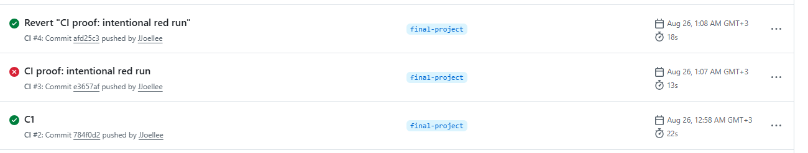
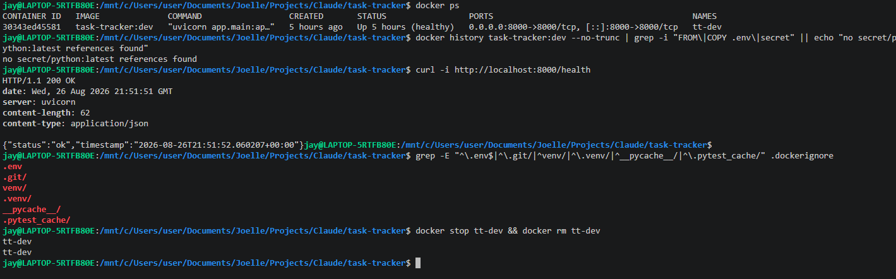

# Release Evidence

## Baseline

- Branch: `final-project`
- Date: 2026-08-26
- Local app run command: `uvicorn app.main:app --reload --port 8000`
- `/health` result: `200 OK`, `{"status":"ok","timestamp":"2026-08-26T21:07:57.148425+00:00"}`
  (verified against a clean instance started for this check; also confirmed
  against the already-running instance on port 8000 forwarded from WSL/Docker
  — same result, same code path)
- Frontend check: served with `python -m http.server 5500` from `frontend/`,
  opened `http://localhost:5500/index.html`. Confirmed live via browser
  automation, not just visually: all three Kanban columns render
  (`ToDo`/`InProgress`/`Done`), and the create → edit flow works end to end —
  created a task through the "New Task" modal, confirmed it appeared on the
  board, opened it via Edit, confirmed the modal pre-filled with the same
  data. Test task deleted afterward to leave the instance clean.
- Test command: `pytest -v`
- Test result: **45 passed**, 0 failed. (31 from Modules 1-3, 11 from the
  mid-course project, 3 new regression tests added in this final-project
  pass — see "Bug found and fixed" below.)

## CI evidence

- Workflow file: `.github/workflows/ci.yml`
- Latest run link or note: verified via the GitHub Actions API (not inferred
  from commit messages) across three commits on this repo during Module 4:
  `784f0d2` (baseline) → success; `e3657af` (intentional one-line test break)
  → failure; `afd25c3` (revert) → success. Full green → red → green cycle
  confirmed real, not just configured.
- Test command used by CI: `pytest -v`
- Shortcut check: no `continue-on-error`, no `|| true`, no `--exit-zero`,
  pytest is not skipped or piped into anything that would hide its exit
  code, Python version is pinned exactly (`3.11`, not `latest` or
  unspecified), dependency installation step is present and separate from
  the test step.



## Docker evidence

- Build command: `docker build -t task-tracker:dev .`
- Run command: `docker run -d --name tt-dev -p 8000:8000 task-tracker:dev`
- `/health` check: `curl -i http://localhost:8000/health` → `200 OK` with the
  expected JSON body. Also confirmed via the `HEALTHCHECK` instruction
  itself: `docker inspect --format='{{.State.Health.Status}}' tt-dev` →
  `healthy`.
- Non-root check: `docker exec tt-dev whoami` → `app` (not `root`).
- No-baked-secrets check: `Dockerfile` never copies `.env` — only
  `requirements.txt` and `app/` are copied into the final image (see
  multi-stage build); `.dockerignore` excludes `.env`, `.git/`, `venv/`,
  `.venv/`, `__pycache__/`, `.pytest_cache/`; `docker history
  task-tracker:dev --no-trunc` shows no secret- or `python:latest`-related
  layers.
- Base image: `python:3.11-slim` for both build stages, not `latest`.
- Full design rationale, including a real (not reputation-based)
  alpine-vs-slim benchmark that was actually built and compared:
  [docs/decisions/dockerfile-design.md](decisions/dockerfile-design.md).



## Bug found and fixed

Module 5's security review (`docs/security-review.md`, finding H-03) flagged
that `PATCH /tasks/{id}` with `{"description": null}` could break
`TaskResponse`'s type contract. This was not accepted on faith — reproduced
independently end to end before touching any code:

```
PATCH /tasks/{id} {"description": null}  ->  200, stores description=None
GET /tasks?search=<term not matching the title>  ->  500 Internal Server Error
```

Root cause: `TaskUpdate.description` had no validator preventing `None`
(unlike `title`), `storage.update_task` applies updates via
`model_copy(update=...)`, which does not re-validate, and
`storage.get_all_tasks`'s search calls `.lower()` on the description with no
null-check.

While fixing it, checked whether the same bug class affected the other
`Optional` fields on `TaskUpdate` whose `TaskResponse` counterpart is
*not* optional — it did. `PATCH {"status": null}` and
`PATCH {"priority": null}` both stored `None` in fields typed as
`TaskStatus`/`TaskPriority` the same way. The `status` case is worse than
`description`'s: a corrupted `status: null` task would then crash any
*future* transition attempt too, since the business-rule error-message
formatting calls `.value` on the current status.

Fix, `app/models.py`, `TaskUpdate`:
- `description`: normalizes an explicit `null` to `""` (a validator),
  matching how `TaskCreate`'s path already handles a missing description
  (`payload.description or ""` in `storage.add_task`) — clearing a
  description is a meaningful operation, so this succeeds.
- `status` / `priority`: reject an explicit `null` outright (422) — there's
  no sensible default to fall back to; a task must always have a real
  status and priority, so this fails loudly instead of silently
  substituting a value, matching how `title` is already handled.

All three are small, targeted, same-file fixes within the ground rules
("Only change `app/` ... for a small bug fix, security fix, or
documentation-supported correction").

Verified with 3 regression tests
(`test_patch_null_description_normalizes_to_empty_string`,
`test_patch_null_status_returns_422`, `test_patch_null_priority_returns_422`)
and break-tests on all three: reverted each fix individually, confirmed
each test failed with exactly the predicted assertion, confirmed the
*other* two tests still passed (proving they're independently meaningful,
not accidentally coupled), then restored and reconfirmed **45/45
passing**. Full detail in [docs/final-ai-review.md](final-ai-review.md).

## Documentation claim-vs-reality log

| Claim checked | Evidence used | Result | Change made, if any |
|---|---|---|---|
| `PATCH /tasks/{id}` with `description`/`status`/`priority: null` is handled safely | Live `curl`/TestClient reproduction against the running app, for all three fields | **False before this pass** — `description: null` caused a `500` on a later search; `status`/`priority: null` silently corrupted the task | Fixed in `app/models.py` (see "Bug found and fixed" above); 3 regression tests added |
| `POST /tasks` returns `201`, `DELETE /tasks/{id}` returns `204` with an empty body | Live `curl -w "%{http_code}"` against a running instance (Module 4, DOC3) | Confirmed accurate | None needed |
| Docker container runs as a non-root user | `docker exec tt-dev whoami` → `app` | Confirmed accurate | None needed |
| CI has no shortcut that hides a real test failure | Direct read of `.github/workflows/ci.yml`, cross-checked against a real red run (`e3657af`) that actually failed the workflow | Confirmed accurate | None needed |
